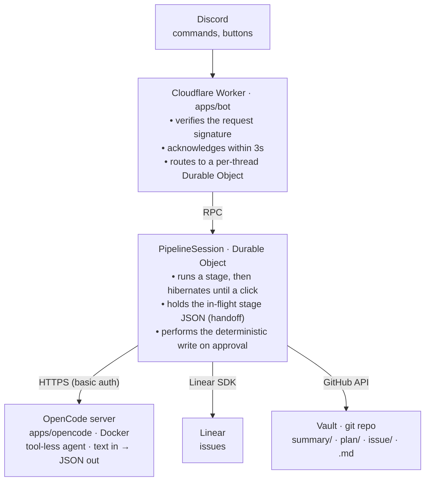

# Discord Project Ops

This project is a proof of concept for an agentic workflow with strong human-in-the-loop (HITL)
that turns discussions into tracked work, without letting an AI act on external systems on its own.

## Prerequisites

## Tooling

- [Bun](https://bun.sh)
- [Wrangler](https://developers.cloudflare.com/workers/wrangler/)
- [Docker](https://www.docker.com/)

### Accounts & services

- A **Cloudflare** account — Workers + Durable Objects (free tier; the SQLite-backed Durable
  Object used here is free-tier eligible).
- A **Discord application** with a bot — you'll need its application ID, public key, and bot
  token, and the bot needs _Send Messages in Threads_, _View Channel_, and _Read Message
  History_. Use a dedicated application, separate from any other bot.
- An **OpenCode** setup with your model subscription, plus a host for the container.
- A **GitHub** repository for the vault, and a token (or GitHub App) with `contents:write`
  and `pull_requests:write` on it.
- A **Linear** workspace, and either an OAuth application or a personal API key.

## Getting started

This repository uses [Mise](https://mise.jdx.dev/) to setup and manage the development environment.

```bash
mise install
```

Install dependencies

```bash
bun install
```

Link an Obsidian vault from a git repository:

```bash
git submodule update --init
```

Then, in order:

1. **OpenCode server** — build and deploy the container.
2. **Bot Worker** — configure `apps/bot/wrangler.jsonc` (IDs, OpenCode URL, models, vault
   repo, write mode) and its secrets, then `bun run --cwd apps/bot register` to register the
   slash commands and `bun run --cwd apps/bot deploy` to ship. Set the Discord _Interactions
   Endpoint URL_ to `https://<your-worker>/interactions`.

Do a dry run on a throwaway forum post — `/summarize` → approve → `/plan` → `/issue` — before
trusting it unattended.

## What it does

This project is a Discord-driven pipeline that takes a Discord forum thread,
summarizes it into a decision record, expands that into an implementation plan, and
decomposes the plan into issues — pausing for explicit human approval before
**every** write to external tools.

Four slash commands drive a three-stage pipeline:

| Command      | Where                               | What it does                                                                                           |
| ------------ | ----------------------------------- | ------------------------------------------------------------------------------------------------------ |
| `/summarize` | in a forum thread                   | Reads the whole thread, proposes a **decision record** → on approval writes `summary/<thread_id>.md`   |
| `/plan`      | thread, or `thread_id` elsewhere/DM | Turns the approved decision into an **implementation plan** → on approval writes `plan/<thread_id>.md` |
| `/issue`     | thread, or `thread_id`              | Decomposes the plan into **Linear issues**, one Approve/Deny per issue                                 |
| `/decide`    | in a forum thread                   | Runs all three in sequence; a denial halts the chain                                                   |

Each stage posts its proposal back to Discord with **Approve** / **Deny** buttons. Approving a
note writes it to the vault; approving an issue creates it in Linear. Nothing is written
until you say so.

## Repository layout

```txt
apps/
  bot/         Cloudflare Worker: interactions, signature verify, PipelineSession
               Durable Object, OAuth callbacks, the deterministic writes
  opencode/    Docker image: opencode serve with a tool-less "pipeline" agent
packages/
  core/        zod schemas + derived JSON Schemas + role prompts + renderers
  linear/      Linear SDK CRUD + OAuth
  github/       GitHub-API client (read / commit / open-PR)
vault/         git submodule: the actual Obsidian markdown (its own repo)
```

## Architecture

Two runtimes, divided by a hard boundary, plus the vault as a separate repo.


